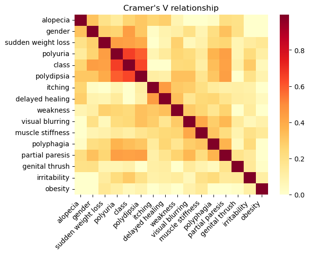

# diabetes_prediction

## Aims of the project
This repository is an example of prediction based on a diabetes questionaire dataset originally published in Islam M.M.F., Ferdousi R., Rahman S., Bushra H.Y. (2020) Likelihood Prediction of Diabetes at Early Stage Using Data Mining Techniques. In: Gupta M., Konar D., Bhattacharyya S., Biswas S. (eds) Computer Vision and Machine Intelligence in Medical Image Analysis. Advances in Intelligent Systems and Computing, vol 992. Springer, Singapore. [https://doi.org/10.1007/978-981-13-8798-2_12](https://doi.org/10.1007/978-981-13-8798-2_12).
It will include a description of the data, its characteristics as well as two types of modeling.
- The first one will aim to be easilly implementable by a human in a clinical condition, i.e. we're trying to obtain an algorithm a human can easily follow and understand.
- The second one will not be bound by such limitations, we will in the end compare precisions in both cases.

## Description of data
Raw data countains 520 rows and 17 different observations.

Note that several rows are duplicate of each others. There is only 251 unique rows. Each row is duplicated at least once.
Although it might be due to several patients having exactly the same profile, this seems unlikely

No missing data in the dataset.

Except for age, all data is binary.

### Dependencies within data

#### Categorical variables
Using Cramer's V (which can be summarised as a measure of chi square scaled from 0 to 1) we can see that most categorical variables bring information not carried by a single others, with the exception of class, polyuria and polydipsia.

As class is our target feature, looking at those three specificly is of interest to our analysis.
