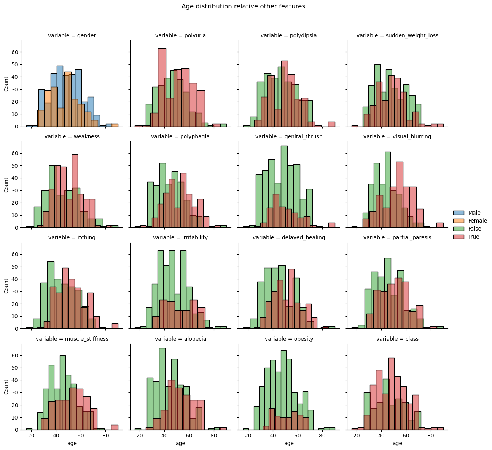
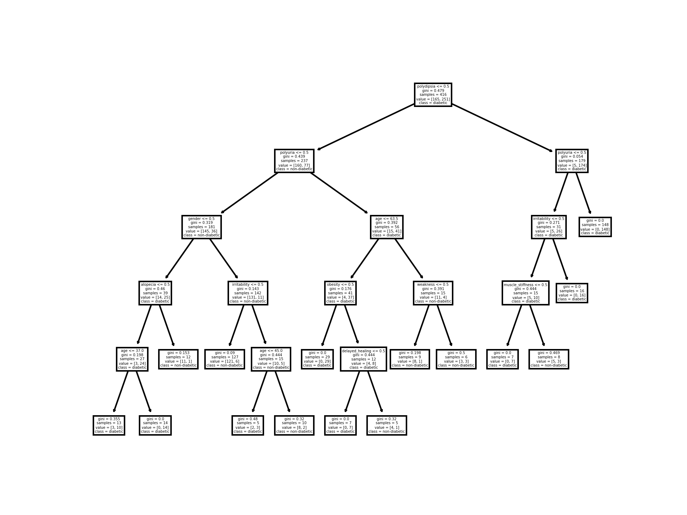

# diabetes_prediction

## Aims of the project
This repository is an example of prediction based on a diabetes questionaire dataset originally published in Islam M.M.F., Ferdousi R., Rahman S., Bushra H.Y. (2020) Likelihood Prediction of Diabetes at Early Stage Using Data Mining Techniques. In: Gupta M., Konar D., Bhattacharyya S., Biswas S. (eds) Computer Vision and Machine Intelligence in Medical Image Analysis. Advances in Intelligent Systems and Computing, vol 992. Springer, Singapore. [https://doi.org/10.1007/978-981-13-8798-2_12](https://doi.org/10.1007/978-981-13-8798-2_12).
It will include a description of the data, its characteristics as well as two types of modeling.
- The first one will aim to be easilly implementable by a human in a clinical condition, we will be using a simple decision tree, with limited depth.
- The second one will not be bound by such limitations, we will in the end compare precisions in both cases. In particular, I'm interested to test the LDE scores compared to XGBoost and RandomForest, who were tested in the original paper.

## Description of data
Raw data countains 520 rows and 17 different observations.

Note that several rows are duplicate of each others. There is only 251 unique rows. Each row is duplicated at least once.
Although it might be due to several patients having exactly the same profile. As this cannot be checked, the duplicates will be removed and following statistics will be outputed only on the prunned dataset.

No missing data in the dataset.

Except for age, all data is binary.

### Data distributions
#### Categorical features

We observe no feature with to much of an extreme bias for one of their value. Hence all of them might be useful. The target feature (class) is also balanced enough.

The most extreme case we observe is that of obesity. But not extreme enough to justify a specific action on it.

#### Continuous features

### Dependencies within data

#### Categorical features
Using Cramer's V (which can be summarised as a measure of chi square scaled from 0 to 1) we can see that most categorical variables bring information not carried by a single others, with the exception of class, polyuria and polydipsia.

As class is our target feature, looking at their contigency table might be of interest.

|       | Polyuria |       |      |
|-------|----------|-------|------|
| Class |          | False | True |
|       | False    | 73    | 5    |
|       | True     | 46    | 127  |

|       | Polydipsia |       |      |
|-------|------------|-------|------|
| Class |            | False | True |
|       | False      | 74    | 4    |
|       | True       | 53    | 120  |

Those variables are clearly useful, but will not be enough for the level of precision we are looking to obtain. These variables are also not close enough between themselves to consider removing one.

#### Numerical variables

Nothing much to say here, age does not seems to have a to high correlation with any other. It also seems nt very informative on class.
We could test this more precisely (by example using a wilcoxon test), but this will not change the preditcion tasks.

## Clinical diagnostic (Decision Tree)
The aim of this part is to create and evaluate a decision tree easily usable in the clinical context, that a health professional could understand and possibly adapt based on non represented variables.

We will separate data into train which will be used to fit the model (using cross validation to explore several parameters) and show the results on the tested data.

Note on the scoring system : in a real application environment, the scoring would be adapted to the planned utilisation of the test. For example, if the test was to be deployed for any single human on earth, and the treatment was instensive, we would choose a measurment that would keep the False Positive Rate low. This decision of what scoring system to use should be taken with professional of the field, and with care.

Here we will use the default (accuracy), but the ideally we should adapt it to the problem.

### Results
Under the rough constraint of a human easily usable algorithm (even our best parameters search was constrained, for example not exploring beyond 15 leaf nodes.) We obtain the following algorithm that yields an accuracy of 88%.

As expected from our data analysis, polyuria and polydipsia are early nodes (they are very discriminatory)

## Full classification
In this part, I want to compare the accuracy results of random forest, XGBoost and LCE on this dataset. As well as see which measure of accuracy we can get.

For comparison with the DecisionTree classifier, the train test split will be kept the same.
